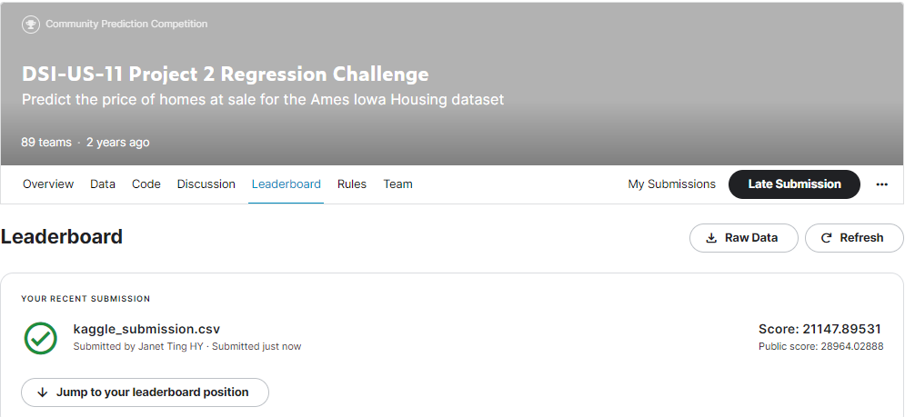

# Project 2 - Ames Housing Data and Kaggle Challenge

## Executive Summary & Background
Our company started a new project to determine the key housing features to highlight and to predict the future housing price in Ames, Iowa. Iowa's housing market broke record after record in summer 2021, according to the Iowa Association of REALTORS® (IAR).([*source*](https://www.weareiowa.com/article/news/local/after-another-record-breaking-month-iowa-realtor-describes-perfect-storm-housing-market-jen-burkamper/524-b0d79923-32d4-4c82-a6a5-de3c10afbc02))

The most important predictors within this model were 
- ground living area square footage, 
- the quality of the exterior facade, 
- basement square footage, 
- basement quality and 
- kitchen quality 
- Neighborhoods (<b>Stone Brook</b> and <b>Northridge Heights</b> have a strong positive impact on sale price while <b>Old Town</b> and <b>North Ames</b> have a negative impact on sale price

In terms of features, homes with a second story or a second kitchen tended to have lower house prices.

## Problem Statement
As being employed by a professional realtor company, which specializes in buying in the existing properties, performing valuation on houses and selling-out these properties for profit, I'm given task to optimize the investment and maximize the ROI (Return on Investment). Subsequently, this information can pass down to home sellers and buyers along the different phases of the process. 

To achieve that, this study aims to:
* Develope a predictive model to estimate the price of houses based on fixed features i.e. characteristics that cannot be easily renovated (e.g. location, square feet, number of bedrooms and bathrooms)
* Identify top 5 important features for high sale price houses 

**Problem Statement:** Given a list of houses' IDs, what are the predicted house Sale Price for each? 

## Data Dictionary
The data dictionary that summarized our data [data dictionary](http://jse.amstat.org/v19n3/decock/DataDocumentation.txt). 

## EDA
Data management team has gathered housing data for houses sold from year 2006 to 2010 for us. From Ames housing dataset provided, there were over 2000 housing observations and more than 80 features (e.g. square feet, house condition, kitchen quality, material quality, etc.).To get preliminary views of relationships between our features, I started off performing a series of exploratory visualizations analyzing our target `SalePrice` and our predictors. I found that the features, neighbourhood, the size of certain areas of the house, house age and overall quality seem to exhibit a strong relationship with Sale Prices.

## Data Cleaning
This was followed by data cleaning, where I dealt with null and missing values. In general, I used <b>label encoding</b> to deal with categorical variables and <b>one-hot encoding</b> to deal with nominal variables.  

## Feature Engineering
To reduce the total number of features, I used two dimensionality reduction techniques - elimination of features according to variance, and elimination of features according to pairwise correlation and correlation with target. <b>Recursive Feature Elimination</b> was also used to help weed out redudant variables. Some new variables are created and tested by combining 2 or more features.

## Model Evaluation
The `train` dataset was split into two parts; train part and test part. The train acts as data to train model and the test acts as new/ unseen data to score the model. After testing out various types of <b>regularization</b> such as Ridge, Lasso and ElasticNet regression, I settled on a *Lasso* regression model as it returned the best R-Squared and RMSE score. 

### Summary of Evalutaion

|Model|CV_R2_score|Test_R2_score|Test_RMSE|Optimal_Alpha|
|---|---|---|---|---|
|LinearReg|0.888|0.906|24387|NA|
|Ridge|0.890|0.905|24564|43.212|
|Lasso|0.891|0.905|24556|294.367|
|ElasticNet|0.890|0.904|24610|0.065|

## Conclusion & Recommendation
Utilizing the Ames Housing Dataset, we developed a model based on **Lasso Regression** for the prediction of sale price for a house in Ames. On the dataset comprising of 25% of the train data, the model achieved an RMSE of 24034. On the dataset comprising of the other 75% of the train data, the model performed within expectations, returning an RMSE of 24556. This is a strong improvement over the baseline RMSE generated by using the mean of all sale prices as predictions. It also has a high R2 on our training data, where it can explain up to 89.1% of the variance in Sales price.

Our top features are living area and overall quality, followed by a range of features looking at basement square footage and the quality of the exterior and kitchen. Home functionality and the number of cars that a garage can fit are also important in predicting sale price. Certain neighborhoods like Northridge Heights and Stone Brook also are strong positive predictors.

Based on our model, we suggest the below pointers if somone is looking to increase the value of their house:
- Improve the overall and exterior condition and quality of their homes through renovation/ remodelling.
- Improve garage size to allow it to fit more than one car.
- Focus on creating a single indoor kitchen (if they have two kitchens).
- Reduce the number of bedrooms in the house, or renovate existing bedrooms to make them multi-purpose rooms (if the house has more than three bedrooms).

### Possible Limitations
This housing prediction model is subject to the following factors to deem its practicability, as referenced ([source](https://www.investopedia.com/articles/mortages-real-estate/11/factors-affecting-real-estate-market.asp)):
1) Geographical features, seasonal weather or demographics of that particular city.
2) Interest rate
3) the Economy/ Inflation
3) Government Policies

### Future works
Lastly, a useful study could be done given the demographics of the people who bought the houses in Ames. Information such as the age, income, and regional preferences of actual or potential buyers, what percentage of buyers are retirees, and what percentage might buy a vacation or second home could be useful. These information are known to be factors affecting the real estate market ([source](https://www.investopedia.com/articles/mortages-real-estate/11/factors-affecting-real-estate-market.asp)). Building a model around such information would also make it more generalizable to other cities.

## Kaggle submission

